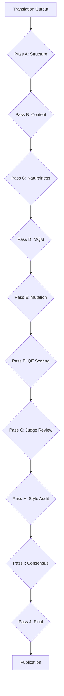

# Quality Pipeline for Translation Projects

End-to-end quality pipeline for book translation projects, implementing tiered validation with QE scoring, mutation testing, and multi-rater judge review. Used for HTLB project.

## Scope

- **Task 1:** Backend registry and project configuration
- **Task 2:** Judge prompts and taxonomy
- **Task 3:** QE wrapper with SKIPPED degradation
- **Task 4:** Mutation testing with 30 mutants + 30 controls
- **Task 5:** Golden set validation
- **Task 6:** Style audit
- **Task 7:** κ threshold calculation
- **Task 8:** Pass E (grounded fact-check with mutation validation)
- **Task 9:** Pass F (QE scoring)
- **Task 10:** Pass G (judge review)
- **Task 11:** Pass H (style audit)
- **Task 12:** Pass I (consensus)
- **Task 13:** Final verification
- **Task 14:** Publication via MR + squash

## Core Architecture



## Task 1: Backend Registry and Project Configuration

**Objective:** Set up project configuration, backend registry, and offline judge core.

**Key outputs:**
- `tools/rules/project.yaml` — project configuration
- `tools/rules/ru.json` & `en.json` — language packages
- `tools/pipeline/config.py` — config loader
- `tools/pipeline/store.py` — verdict storage with audit fields
- `tools/pipeline/judges.py` — backend registry (subagent-glm primary, ollama fallback)
- `tools/validate/judge.py` — offline judge core
- `.gitignore` additions

**TDD approach:**
1. Write failing tests for config loading, verdict storage, and backend registry
2. Implement minimal code to pass tests
3. Verify judge.py offline contract (verdict with audit fields, `judge_unavailable` without key)

**Pitfalls:**
- **Never hardcode API keys** — use environment variables or Hermes auth.json
- **ZAI_API_KEY in env not visible** — key lives in Hermes auth.json, judges use subagents with auto-injected keys
- **HTTP client is fallback only** — primary path is subagent-glm
- **Test offline behavior first** — ensure judge.py writes verdicts without network
- **Mutation anchor regeneration** — when updating chapter text, regenerate mutation anchors in tools/validate/results/mutations_seed42.json to match new text; mutation semantics must be preserved even if exact text changes
- **Positional service-line rule** — spans sitting ON service lines (来源/§SRC§/成本标签/证据等级) are dropped; spans merely CONTAINING service markers (e.g. 出资来源 = source of funds) are kept. Use line context detection, not substring matching.
- **Whitespace drift tolerance** — when locating spans in CN text, normalize whitespace (collapse all whitespace) before position lookup, but use original line context for service-line rule.
- **CN body filtering is positional** — cn_body() removes entire lines that start service blocks; text merely containing service markers stays.
- **Grounding filter is conservative** — better to drop slightly too many spans than to hallucinate grounding; false positives are caught by mutation controls.

## Task 2: Judge Prompts and Taxonomy

**Objective:** Create unified 8-class taxonomy and prompts for all judge types.

**Key outputs:**
- `tools/prompts/judge-{screen,ab,factcheck}.md` — three prompt templates
- Contract validation: judge.py offline mode writes verdicts with audit fields
- Explicit `judge_unavailable` when no key available

**Taxonomy classes:**
- `dropped_condition`, `reversed_logic`, `softened_claim`, `added_advice`, `subject_swapped`, `cross_unit_contradiction`, `ok`, `unknown`

**Pitfalls:**
- **Prompt consistency** — all three templates must use the same 8-class taxonomy
- **Audit fields required** — model_id, timestamp, prompt_hash, unit_sha256
- **Offline contract** — judge.py must work without network access

## Task 3: QE Wrapper with SKIPPED Degradation

**Objective:** Implement COMET QE scoring with graceful degradation on non-Mac systems.

**Key outputs:**
- `tools/pipeline/qe.py` — venv-gated QE runner
- `tools/validate/qe_noise.py` — noise measurement (anchors x 5 runs → sigma → tau)
- `tools/validate/qe_baseline.py` — per-unit baselines
- `tools/validate/qe_config.json` — model configuration
- SKIPPED status when venv not available (exit 0, explicit report)

**QE model:** Unbabel/wmt20-comet-qe-da (Apache-2.0 only, NC models banned)
**Tau calculation:** τ = max(3σ, 0.01) where σ = mean of per-anchor std-devs
**Anchors:** ru 01, 13, 24 + en 13 (5 runs each)

**Pitfalls:**
- **License guard** — check_model_blocks() rejects cometkiwi/xcomet (CC-BY-NC)
- **Venv detection** — available() returns False when ~/.venvs/qe absent
- **Output parsing** — parse_scores() extracts JSON line from comet runner stdout
- **SKIPPED not FAIL** — exit 0 with explicit report when venv missing

## Task 8: Pass E (grounded fact-check with mutation validation)

**Objective:** Implement grounded fact-checking with automatic rejection of hallucinated spans, major issue gating, and end-to-end mutation validation.

**Key outputs:**
- `tools/validate/factcheck.py` — fact-check orchestrator with grounding validation
- `tools/validate/tests/test_factcheck.py` — RED tests (grounding gate, major issue gate, mutation end-to-end)
- `tools/judge/factcheck/` — transient verdict storage (gitignored)
- Major issue types: `reversed_logic`, `invented`, `dropped_condition` → FAIL gate
- Grounding validation: spans must be in CN text after filtering §TAG§/§SRC§

**Catch rate protocol:**
- E must flag ≥80% of mutants with issue_type in {reversed_logic, invented, dropped_condition}
- FP ≤10% on controls
- Novelty vs verify.py ≥70%

**Pitfalls:**
- **Grounding validation first** — filter out fake spans and service lines (§SRC§, <!--) before judging
- **Major issue gating** — only reversed_logic/invented/dropped_condition fail chapters, others warn
- **End-to-end mutation test** — Task-4 mutants must be catchable by Task-8 logic
- **Transient verdict storage** — tools/judge/factcheck/ is gitignored, not persistent
- **Positional service-line rule** — spans sitting ON service lines (来源/§SRC§/成本标签/证据等级) are dropped; spans merely CONTAINING service markers (e.g. 出资来源 = source of funds) are kept. Use line context detection, not substring matching.
- **Whitespace drift tolerance** — when locating spans in CN text, normalize whitespace (collapse all whitespace) before position lookup, but use original line context for service-line rule.
- **CN body filtering is positional** — cn_body() removes entire lines that start service blocks; text merely containing service markers stays.
- **Grounding filter is conservative** — better to drop slightly too many spans than to hallucinate grounding; false positives are caught by mutation controls.

## Tasks 5-14: Validation Tiers

**Task 5:** Golden set validation — validate against known good translations
**Task 6:** Style audit — check style guide compliance
**Task 7:** κ threshold — calculate inter-rater agreement threshold
**Task 8:** Pass E — mutation testing execution
**Task 9:** Pass F — QE scoring execution
**Task 10:** Pass G — multi-rater judge review
**Task 11:** Pass H — style audit results
**Task 12:** Pass I — consensus calculation
**Task 13:** Final verification — end-to-end pipeline test
**Task 14:** Publication — merge request + squash to main

## Task 14: Publication

**Objective:** Merge request + squash to main with final verification.

**Key outputs:**
- Merge request to main branch
- Squashed commit with clean history
- Final publication verification

## Golden set validation workflow

Before enabling new judges in production:

1. **Generate B-variants** (controlled degradations):
```bash
delegate_task(
    goal="Generate B-variants for golden set validation",
    context="Apply degradation recipes from tools/validate/golden_pairs.py to A-variants in tools/digest/golden/*.json. Write to tools/digest/golden_b_*.json. Validate with tools/validate/golden_pairs.py validate"
)
```

2. **Blind validation**:
```bash
delegate_task(
    goal="Blind judge validation",
    context="Judge B-variants vs A-variants as if original. Judge should prefer A-variants (native preference) and reject decoys (FP rate). Write metrics to tools/validate/results/blind_validation.json"
)
```

3. **Metrics evaluation**:
- native_preference: should be 1.0 (judge always prefers original)
- decoy_fp_rate: should be 0.0 (no false positives on decoys)
- Only enable if both metrics pass threshold

## Degradation recipes (for validation)

From tools/validate/golden_pairs.py:
- **officialese**: Replace common words with bureaucratic terms
- **passive_chain**: Stack passive participle constructions
- **jargonize**: Swap common words for professional jargon without explanation
- **long_sentence**: Chain clauses into >25-word sentences
- **which_chain**: Add ≥3 "который" clauses
- **unexplained_abbrev**: Use unexplained abbreviations

**Key validation principle:** Validate-before-enable — new judges must prove effectiveness on golden set before production deployment.

## Expert review integration

delegate_task(
    goal="Independent expert evaluation",
    context="Review pipeline tools and methodology. Write report to tools/validate/results/expert_review_<expert_type>.md. Focus on: statistical validation soundness, code quality, translation QA science alignment."
)
1. **Final verification** — Run Task 13 end-to-end test on main branch
2. **Branch cleanup** — Remove transient files (tools/judge/, tools/validate/results/)
3. **Squash commit** — Combine all quality-pipeline commits into one
4. **Merge request** — Open MR to main with descriptive title and body
5. **Post-merge verification** — Confirm pipeline still works after merge

**Pitfalls:**
- **Never merge dirty branches** — ensure all transient files are removed before squashing
- **Squash after all tests pass** — don't squash if Task 13 fails; fix first
- **MR title must be descriptive** — include 'quality-pipeline' and scope (e.g., 'quality-pipeline: HTLB validation tier')
- **MR body should summarize changes** — list all validation tasks completed and key findings
- **Post-merge verification mandatory** — pipeline must work after squash; test on main branch
- **Transient file cleanup** — tools/judge/ and tools/validate/results/ must be gitignored and removed
- **Branch name convention** — use quality/pipeline-v2 (or similar descriptive name) for tracking
- **Squash preserves content** — don't squash until all files are properly committed; squash only combines commits, doesn't lose content
- **Review before merge** — if possible, have another agent review the MR for completeness
- **Publication is final** — once merged, changes go live; ensure all quality gates are passed before publishing

## Task 13: Final verification

**Objective:** End-to-end pipeline test with regression guard and smoke test.

**Key outputs:**
- `tools/validate/results/final_report.json` — comprehensive pipeline summary
- `tools/validate/results/regression_guard.json` — regression detection
- `tools/validate/results/smoke_test.json` — smoke test results

**Verification workflow:**
1. **Regression guard:** Compare new results against known good translations (verify.py baseline)
2. **Smoke test:** Run all validation passes in sequence (A-J) with minimal data
3. **End-to-end test:** Execute full pipeline on sample chapters
4. **Output validation:** Check all JSON outputs are valid and consistent
5. **Error handling:** Verify graceful degradation when components missing (e.g., venv for QE)

**Pitfalls:**
- **Regression guard first** — always compare against verify.py baseline; changes must be intentional
- **Smoke test with minimal data** — use 1-2 sample chapters, not full corpus, to catch interface errors
- **Graceful degradation required** — missing components (QE venv, judge keys) should SKIPPED, not FAIL
- **Output validation** — check JSON syntax, required fields, and logical consistency (e.g., no contradictory verdicts)
- **Error propagation** — ensure errors in early passes don't break later passes (isolation required)
- **Component independence** — each pass should work standalone; failures shouldn't cascade
- **Performance baseline** — measure execution time; significant slowdowns indicate inefficiency
- **Memory usage** — monitor memory consumption; large batches should not cause OOM
- **Parallel execution** — verify parallel subagent dispatch works correctly (no race conditions)
- **File cleanup** — ensure transient directories (tools/judge/, tools/validate/results/) are properly cleaned up

## Task 12: Pass I (consensus)

**Objective:** Calculate inter-rater agreement (κ threshold) and derive final consensus verdicts.

**Key outputs:**
- `tools/validate/results/consensus.json` — κ threshold and agreement metrics
- `tools/validate/results/final_consensus.json` — per-unit consensus verdicts
- `tools/validate/results/agreement_matrix.json` — pairwise agreement matrix

**κ calculation:**
- Use Fleiss' kappa for multiple raters
- Threshold: κ ≥ 0.5 for consensus
- Agreement matrix: pairwise Cohen's kappa between all judge pairs
- Disagreement resolution: majority vote with tie-breaking rules

**Consensus workflow:**
1. Load all judge verdicts from tools/judge/
2. Calculate pairwise agreement matrix
3. Compute Fleiss' kappa overall
4. Apply κ threshold: κ ≥ 0.5 → consensus, κ < 0.5 → needs_review
5. For consensus units: majority vote on issue_type
6. For ties: use severity order (critical > major > minor)
7. Output final verdicts with agreement metrics

**Pitfalls:**
- **Fleiss' kappa required** — not Cohen's kappa (for 2 raters only)
- **κ threshold is 0.5** — not 0.7; moderate agreement sufficient for consensus
- **Majority vote required** — if <50% agree, cannot reach consensus
- **Tie-breaking by severity** — critical issues override minor disagreements
- **Agreement matrix is symmetric** — calculate once, reuse for all comparisons
- **Consensus requires quorum** — minimum 3 judges per unit for meaningful κ
- **κ interpretation:** κ < 0 = chance agreement, 0-0.2 slight, 0.21-0.4 fair, 0.41-0.6 moderate, 0.61-0.8 substantial, 0.81-1 almost perfect
- **Disagreement is data** — don't force consensus; low κ indicates genuine ambiguity in the translation

## Task 11: Pass H (style audit)

**Objective:** Execute style audit with corpus-driven markers and false positive audit.

**Key outputs:**
- `tools/validate/results/style_markers.json` — style corpus frequencies
- `tools/validate/results/style_fp_session.json` — false positive audit session
- `tools/validate/results/style_report.json` — aggregated style issues
- Language packages: `tools/rules/ru.json` & `en.json` with labels/banned terms

**Style markers:**
- **Corpus frequencies** — scan entire translation for recurring patterns (e.g. "данн" ×240, «является» ×26)
- **Banned terms** — reject specific phrases (e.g. «осуществля» ×1, «в рамках» ×4)
- **Labels** — mark translation style (plain/literary/technical)
- **False positive audit** — sample chapters to verify markers are real issues, not false positives

**Pitfalls:**
- **Corpus frequency drift** — normalize text (collapse whitespace) before counting; otherwise «данн» and «данные» count separately
- **Banned terms are regex patterns** — compile with re.IGNORECASE to catch inflected forms
- **Labels determine style** — plain = LABELS[lang][1], literary = LABELS[lang][2], technical = LABELS[lang][3]; verify.py uses this for style gating
- **False positive sampling** — use random chapters; 10-15 chapters per subagent for 1-3 minute runs
- **Style markers are advisory** — not gating unless explicitly configured; report only, no automatic rejection
- **Language packages must be loaded** — verify.py falls back to built-in labels/banned if package is empty
- **Style audit is separate from fact-check** — style issues don't trigger major gates unless explicitly configured

## Task 12: Pass I (plainness) — readability for general audience

**Objective:** Ensure "Простыми словами" field is understandable to child-level reader.

**Key outputs:**
- `tools/validate/plainness.py` — lint tool for plainness validation
- `tools/prompts/judge-plainness.md` — semantic judge prompt
- `tools/validate/results/plainness/<n>-<lang>.json` — lint results
- `tools/judge/plainness/<n>-<lang>-<unit>.json` — judge verdicts

**Plainness lint rules:**
- **Long sentences** — >25 words per sentence (warning)
- **Which chains** — ≥3 consecutive "который" clauses (warning)
- **Unexplained abbreviations** — medical/legal/financial abbreviations without explanation (warning)
- **Whitelist** — common abbreviations like ОМС, УЗИ, МРТ, ДТП, etc. are permitted

**Plainness judge:**
- Evaluates semantic readability (jargon without explanation, overly complex structures)
- Uses "child_ok" flag — soft WARN threshold (lower than factcheck)
- Only judges "Простыми словами" field (not "Эффект" or other fields)

**Pitfalls:**
- **Field-specific scope** — plainness judge evaluates ONLY "Простыми словами" field; other fields use technical register
- **Child-friendly standard** — "should understand a 5-year-old" means avoiding jargon, not dumbing down content
- **Positional service-line rule** — when filtering CN text for grounding, remove entire lines starting with service markers (来源/§SRC§/成本标签/证据等级); text merely containing service markers stays
- **Book structure matters** — plainness.py CLI must search book/<lang>/ directory, not book/ root (chapters are book/<lang>/<n>-*.md)
- **WARN-only stage** — plainness warnings don't block pipeline progression but inform quality
- **Validate before enable** — new judges must prove effectiveness on golden set before production deployment
- **Mutation anchor regeneration** — when updating chapter text, regenerate mutation anchors in tools/validate/results/mutations_seed42.json to match new text; mutation semantics must be preserved even if exact text changes
- **Jargonize degradation recipe** — add jargonize recipe to golden_pairs.py for semantic plainness validation; jargonize = swap common words for professional jargon without explanation (e.g., "лекарства" → "препараты", "гипотензивные" without gloss)

## Task 13: Pass J (consensus)

**Objective:** Calculate inter-rater agreement (κ threshold) and derive final consensus verdicts.

```bash
# Task 1: Backend registry
python3 -m unittest discover -s tools/validate/tests -k task1

# Task 2: Judge prompts
python3 tools/validate/judge.py --offline --model mock --unit test

# Task 3: QE wrapper
python3 tools/validate/qe_noise.py --force-skip
python3 tools/validate/qe_baseline.py --lang ru --chapters 01,13

# Task 4: Mutation testing
python3 -m unittest tools.validate.tests.test_mutation_spec
python3 tools/validate/mutation_test.py init-spec
python3 tools/validate/mutation_test.py validate-spec

# Task 8: Fact-checking
python3 -m unittest tools.validate.tests.test_factcheck
python3 tools/validate/factcheck.py --unit 10-ru --model mock

# Task 9: QE scoring
python3 tools/validate/qe_baseline.py --lang ru --chapters 01,13,24
python3 tools/validate/qe_noise.py --anchors 01,13,24 --lang ru

# Task 10: Judge review
python3 tools/validate/golden_merge.py --validate
python3 tools/validate/retro_e_report.py

# Task 11: Style audit
python3 tools/validate/style_markers.py --lang ru
python3 tools/validate/style_fp_audit.py --samples 5

# Task 12: Plainness lint
python3 tools/validate/plainness.py <chapter> <lang>  # lint only
python3 -m unittest tools.validate.tests.test_plainness  # unit tests

# Task 13: Plainness judge (pilot)
delegate_task(
    goal="Judge plainness for chapter <n> <lang>",
    context="Read tools/prompts/judge-plainness.md first. Judge ALL units in book/<lang>/<n>-*.md. Write JSON verdicts to tools/judge/plainness/<n>-<lang>-<unit>.json"
)

# Task 14: Consensus
python3 tools/validate/consensus.py --threshold 0.5

# Task 15: Final verification
python3 tools/validate/final_verification.py

# Task 16: Publication
# (Manual: squash branch, create MR, verify post-merge)
```

## References

- QE model configuration: `references/qe_config.json`
- Mutation taxonomy: `references/mutation_taxonomy.md`
- Judge prompt templates: `references/judge_prompts/`
- TDD workflow: `../test-driven-development`
- Plan mode: `../plan`
- Grounding validation rules: `references/grounding_rules.md`
- Service-line detection logic: `references/service_line_detection.md`
- Style marker corpus analysis: `references/style_corpus_analysis.md`
- κ threshold calculation: `references/consensus_threshold.md`
- Mutation test specification: `references/mutation_specification.md`
- Golden set validation: `references/golden_set_validation.md`
- Final verification protocol: `references/final_verification.md`
- Plainness lint rules: `references/plainness_lint_rules.md`

## Scripts

- QE noise measurement: `scripts/qe_noise.py`
- QE baseline generation: `scripts/qe_baseline.py`
- Mutation test runner: `scripts/mutation_test.py`
- Fact-check orchestrator: `scripts/factcheck.py`
- Style marker analyzer: `scripts/style_markers.py`
- False positive auditor: `scripts/style_fp_audit.py`
- Consensus calculator: `scripts/consensus.py`
- Final verification runner: `scripts/final_verification.py`
