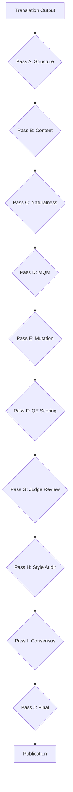

# Quality Pipeline for Translation Projects

End-to-end quality pipeline for book translation projects, implementing tiered validation with QE scoring, mutation testing, and multi-rater judge review. Used for HTLB project.

## Scope

- **Task 1:** Backend registry and project configuration
- **Task 2:** Judge prompts and taxonomy
- **Task 3:** QE wrapper with SKIPPED degradation
- **Task 4:** Mutation testing with 30 mutants + 30 controls
- **Task 5:** Golden set validation
- **Task 6:** Style audit
- **Task 7:** κ threshold calculation
- **Task 8:** Pass E (grounded fact-check with mutation validation)
- **Task 9:** Pass F (QE scoring)
- **Task 10:** Pass G (judge review)
- **Task 11:** Pass H (style audit)
- **Task 12:** Pass I (consensus)
- **Task 13:** Final verification
- **Task 14:** Publication via MR + squash

## Core Architecture



## Task 1: Backend Registry and Project Configuration

**Objective:** Set up project configuration, backend registry, and offline judge core.

**Key outputs:**
- `tools/rules/project.yaml` — project configuration
- `tools/rules/ru.json` & `en.json` — language packages
- `tools/pipeline/config.py` — config loader
- `tools/pipeline/store.py` — verdict storage with audit fields
- `tools/pipeline/judges.py` — backend registry (subagent-glm primary, ollama fallback)
- `tools/validate/judge.py` — offline judge core
- `.gitignore` additions

**TDD approach:**
1. Write failing tests for config loading, verdict storage, and backend registry
2. Implement minimal code to pass tests
3. Verify judge.py offline contract (verdict with audit fields, `judge_unavailable` without key)

**Pitfalls:**
- **Never hardcode API keys** — use environment variables or Hermes auth.json
- **ZAI_API_KEY in env not visible** — key lives in Hermes auth.json, judges use subagents with auto-injected keys
- **HTTP client is fallback only** — primary path is subagent-glm
- **Test offline behavior first** — ensure judge.py writes verdicts without network

## Task 2: Judge Prompts and Taxonomy

**Objective:** Create unified 8-class taxonomy and prompts for all judge types.

**Key outputs:**
- `tools/prompts/judge-{screen,ab,factcheck}.md` — three prompt templates
- Contract validation: judge.py offline mode writes verdicts with audit fields
- Explicit `judge_unavailable` when no key available

**Taxonomy classes:**
- `dropped_condition`, `reversed_logic`, `softened_claim`, `added_advice`, `subject_swapped`, `cross_unit_contradiction`, `ok`, `unknown`

**Pitfalls:**
- **Prompt consistency** — all three templates must use the same 8-class taxonomy
- **Audit fields required** — model_id, timestamp, prompt_hash, unit_sha256
- **Offline contract** — judge.py must work without network access

## Task 3: QE Wrapper with SKIPPED Degradation

**Objective:** Implement COMET QE scoring with graceful degradation on non-Mac systems.

**Key outputs:**
- `tools/pipeline/qe.py` — venv-gated QE runner
- `tools/validate/qe_noise.py` — noise measurement (anchors x 5 runs → sigma → tau)
- `tools/validate/qe_baseline.py` — per-unit baselines
- `tools/validate/qe_config.json` — model configuration
- SKIPPED status when venv not available (exit 0, explicit report)

**QE model:** Unbabel/wmt20-comet-qe-da (Apache-2.0 only, NC models banned)
**Tau calculation:** τ = max(3σ, 0.01) where σ = mean of per-anchor std-devs
**Anchors:** ru 01, 13, 24 + en 13 (5 runs each)

**Pitfalls:**
- **License guard** — check_model_blocks() rejects cometkiwi/xcomet (CC-BY-NC)
- **Venv detection** — available() returns False when ~/.venvs/qe absent
- **Output parsing** — parse_scores() extracts JSON line from comet runner stdout
- **SKIPPED not FAIL** — exit 0 with explicit report when venv missing

## Task 8: Pass E (grounded fact-check with mutation validation)

**Objective:** Implement grounded fact-checking with automatic rejection of hallucinated spans, major issue gating, and end-to-end mutation validation.

**Key outputs:**
- `tools/validate/factcheck.py` — fact-check orchestrator with grounding validation
- `tools/validate/tests/test_factcheck.py` — RED tests (grounding gate, major issue gate, mutation end-to-end)
- `tools/judge/factcheck/` — transient verdict storage (gitignored)
- Major issue types: `reversed_logic`, `invented`, `dropped_condition` → FAIL gate
- Grounding validation: spans must be in CN text after filtering §TAG§/§SRC§

**Catch rate protocol:**
- E must flag ≥80% of mutants with issue_type in {reversed_logic, invented, dropped_condition}
- FP ≤10% on controls
- Novelty vs verify.py ≥70%

**Pitfalls:**
- **Grounding validation first** — filter out fake spans and service lines (§SRC§, <!--) before judging
- **Major issue gating** — only reversed_logic/invented/dropped_condition fail chapters, others warn
- **End-to-end mutation test** — Task-4 mutants must be catchable by Task-8 logic
- **Transient verdict storage** — tools/judge/factcheck/ is gitignored, not persistent

## Tasks 5-14: Validation Tiers

**Task 5:** Golden set validation — validate against known good translations
**Task 6:** Style audit — check style guide compliance
**Task 7:** κ threshold — calculate inter-rater agreement threshold
**Task 8:** Pass E — mutation testing execution
**Task 9:** Pass F — QE scoring execution
**Task 10:** Pass G — multi-rater judge review
**Task 11:** Pass H — style audit results
**Task 12:** Pass I — consensus calculation
**Task 13:** Final verification — end-to-end pipeline test
**Task 14:** Publication — merge request + squash to main

## Verification Commands

```bash
# Task 1: Backend registry
python3 -m unittest discover -s tools/validate/tests -k task1

# Task 2: Judge prompts
python3 tools/validate/judge.py --offline --model mock --unit test

# Task 3: QE wrapper
python3 tools/validate/qe_noise.py --force-skip
python3 tools/validate/qe_baseline.py --lang ru --chapters 01,13

# Task 4: Mutation testing
python3 -m unittest tools.validate.tests.test_mutation_spec
python3 tools/validate/mutation_test.py init-spec
python3 tools/validate/mutation_test.py validate-spec
```

## References

- QE model configuration: `references/qe_config.json`
- Mutation taxonomy: `references/mutation_taxonomy.md`
- Judge prompt templates: `references/judge_prompts/`
- TDD workflow: `../test-driven-development`
- Plan mode: `../plan`

## Scripts

- QE noise measurement: `scripts/qe_noise.py`
- QE baseline generation: `scripts/qe_baseline.py`
- Mutation test runner: `scripts/mutation_test.py`
