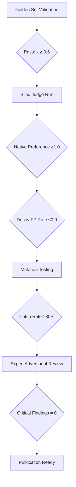

# Translation Quality Validation

End-to-end validation for translation pipelines, combining automated judge review, golden set testing, and expert adversarial evaluation. Used for HTLB project pipeline v2.

## Repo context (2026-09-26)

Quality tools live under `tools/validate/` in `dlgrv/HowToLiveBetter`. Repo orchestration: `pipeline.yaml`, `Makefile`, `translations.json`, `waves.json`, `AGENTS.md`. See `htlb-translation` for overall workflow.

## Scope

- **Task 1:** Blind judge validation (golden set)
- **Task 2:** Judge prompt and taxonomy consistency
- **Task 3:** Mutation testing with controlled degradations
- **Task 4:** Multi-rater expert evaluation
- **Task 5:** Aggregated metrics and publication readiness

## Core Architecture



## Task 1: Blind Judge Validation

**Objective:** Validate judge effectiveness on golden set with controlled degradations.

**Key outputs:**
- `tools/validate/results/golden_judge_run_lite/` — blind run results
- `tools/validate/results/golden_blind_summary.json` — aggregated metrics
- `tools/validate/results/golden_judge_run_full/` — full 60-pair run (optional)

**Validation criteria:**
- native_preference: judge always prefers original (≥1.0)
- decoy_fp_rate: no false positives on decoy pairs (≤0.0)
- order_bias: no AB/BA order effect (should be 0.5)
- length_bias: shorter preference (0/36 for HTLB, since degradations lengthen)

**Implementation:**
```bash
# Lite subset (30 pairs: 18 real + 12 decoys, shuffled)
python3 tools/validate/judge_blind_run.py --subset tools/validate/results/golden_lite_subset.json --out tools/validate/results/golden_judge_run_lite --workers 4

# Full set (60 pairs + 42 decoys)
python3 tools/validate/judge_blind_run.py --subset tools/validate/results/golden_full_subset.json --out tools/validate/results/golden_judge_run_full --workers 4
```

**Pitfalls:**
- **Concurrent run protection**: Always use `--workers` to avoid file race conditions; two concurrent runs into the same outdir corrupt results (see flock guard in judge_blind_run.py)
- **Resume safety**: Error files (`{"error":...}`) are not counted as valid; only files with `decoded` field count as completed
- **Key export**: ZAI_API_KEY or equivalent must be available (check `.env` in repo root). (judges use z.ai GLM-5.3-Flash)
- **Human judge comparison**: After blind run, calculate κ between judge and human ratings to establish inter-rater reliability
- **Stale verdicts**: Always archive v1 judge verdicts before v2 runs (they reference old manifest); move `golden_verdicts_batch*.json` to `golden_verdicts_v1_archive/`
- **Subset randomness**: Use fixed random seed (e.g., 77) for reproducible markup subsets
- **AI API independence**: Judge validation works with offline tools; judge_blind_run.py uses subagents with auto-injected keys, not direct API calls

## Task 2: Judge Prompt and Taxonomy Consistency

**Objective:** Ensure all judge prompts use the same taxonomy and audit fields.

**Key outputs:**
- `tools/prompts/judge-{screen,ab,factcheck}.md` — prompt templates
- Contract validation: judge.py offline mode writes verdicts with audit fields

**Taxonomy classes:**
- `dropped_condition`, `reversed_logic`, `softened_claim`, `added_advice`, `subject_swapped`, `cross_unit_contradiction`, `ok`, `unknown`

**Validation:**
- All three prompts must use identical taxonomy classes
- Judge offline contract must work without network access
- Audit fields required: model_id, timestamp, prompt_hash, unit_sha256

**Pitfalls:**
- **Prompt consistency**: Any taxonomy mismatch between prompts breaks validation
- **Offline contract**: judge.py must work without API keys (test with `--model mock`)
- **AI API independence**: All judge tools must work offline without API dependencies; return `judge_unavailable` status when no key present

## Task 3: Mutation Testing

**Objective:** Validate fact-check pass effectiveness on controlled semantic mutations.

**Key outputs:**
- `tools/validate/results/mutations_seed42.json` — mutation specification
- `tools/validate/mutation_test.py` — test runner
- Mutation test report with catch rate and FP rate

**Validation criteria:**
- Catch rate ≥80% on mutants with issue_type in {reversed_logic, invented, dropped_condition}
- FP rate ≤10% on control units
- End-to-end validation: mutants must be catchable by factcheck logic

**Pitfalls:**
- **Anchor regeneration**: When updating chapter text, regenerate mutation anchors to match new text
- **End-to-end sync**: Factcheck logic must be able to catch all specified mutants
- **Major issue gating**: Only reversed_logic/invented/dropped_condition fail chapters; others warn
- **Number preservation in degradation**: When creating degradations for abridgement, preserve numeric values and statistics; abridgement may only remove text, not change numbers (rule: abridgement must not introduce new numbers or change existing ones).
- **Recipe-aware gate validation**: Use `tools/validate/check_degrade.py` to validate abridgement/bloat pairs; abridgement can only remove text, bloat can only add text; any number change in abridgement or missing numbers in bloat = gate fail

## Task 4: Multi-Rater Expert Evaluation

**Objective:** Independent adversarial evaluation of pipeline components.

**Key outputs:**
- `tools/validate/results/expert_review_<expert_type>.md` — detailed findings
- `tools/validate/tests/adversarial/` — test case suites
- Aggregated fix list and batch implementation

**Expert types:**
- **Code quality expert**: Review architecture, test coverage, error handling
- **Translation QA expert**: Review mutation taxonomy, judge prompts, golden set design
- **Statistical validation expert**: Review κ calculation, catch-rate methodology, FP rate auditing
- **Infrastructure expert**: Review deployment patterns, performance, scalability

**Pitfalls:**
- **Adversarial test design**: Test cases must be realistic, not contrived
- **Expert bias**: Rotate expert types and ensure diverse perspectives
- **Fix validation**: Every fix must be tested locally (124/124 unit tests OK for v2) before committing
- **Merge hygiene**: Never merge transient files (tools/judge/, tools/validate/results/)
- **AI API independence**: Expert evaluation must use offline judge tools; no API dependencies for validation

## Task 5: Aggregated Metrics and Publication Readiness

**Objective:** Calculate final validation metrics and determine publication readiness.

**Key outputs:**
- `tools/validate/results/final_validation_report.json` — comprehensive metrics
- Publication checklist with pass/fail status

**Final metrics:**
- Inter-rater reliability: κ ≥ 0.6 between judge and human
- Mutation catch rate: ≥80% with ≤10% FP
- Expert review: 0 critical findings
- Style audit precision: ≥80%, recall: ≥60%
- QE noise baseline established

**Publication checklist:**
- [ ] All validation tasks completed
- [ ] All critical findings fixed
- [ ] All unit tests pass (124/124 for v2, including decoy count validation)
- [ ] Manifest validation passed (60 pairs, 42 decoys)
- [ ] Post-merge verification planned
- [ ] v1 judge verdicts archived before v2 runs

## Implementation Workflow

```bash
# Task 1: Blind judge validation
python3 tools/validate/judge_blind_run.py --subset tools/validate/results/golden_lite_subset.json --out tools/validate/results/golden_judge_run_lite --workers 4

# Task 2: Judge prompt consistency
python3 tools/validate/judge.py --offline --model mock --unit test

# Task 3: Mutation testing
python3 tools/validate/mutation_test.py validate-spec

# Task 4: Expert evaluation
delegate_task(
    goal="Independent adversarial evaluation of HTLB quality pipeline",
    context="Review pipeline tools and methodology. Write report to tools/validate/results/expert_review_<expert_type>.md. Focus on: statistical validation soundness, code quality, translation QA science alignment."
)

# Task 5: Final metrics
python3 tools/validate/final_validation.py
```

## References

- Judge prompt templates: `references/judge_prompts/`
- Mutation taxonomy: `references/mutation_taxonomy.md`
- Golden set validation: `references/golden_set_validation.md`
- Expert review workflow: `references/expert-review-workflow.md`
- Pipeline validation patterns: `references/pipeline-validation-patterns.md`
- Judge blind runner: `scripts/judge_blind_run.py`
- Mutation test runner: `scripts/mutation_test.py`
- Final validation aggregator: `scripts/final_validation.py`
- **Abridgement/bloat validation gate**: `references/abridgement-bloat-gate.md`
- **Golden manifest regeneration**: `references/golden-manifest-regeneration.md`
- **HTLB v2 golden set workflow**: `references/golden_set_validation.md`

## Scripts

- Blind judge runner: `scripts/judge_blind_run.py`
- Mutation test runner: `scripts/mutation_test.py`
- Expert review aggregator: `scripts/expert_review_aggregator.py`
- Final validation calculator: `scripts/final_validation.py`
