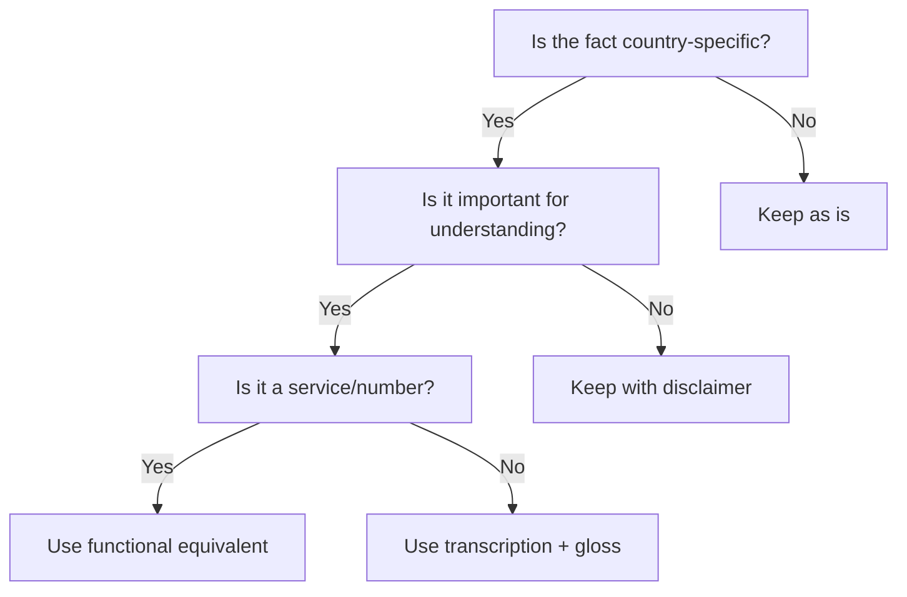

# Localization techniques for translated books

## Overview

When translating content for a target audience, especially from Chinese to Russian, certain cultural and institutional facts require adaptation while preserving accuracy. These techniques are for use when the user requests localization or marking of country-specific facts.

## Catalog of techniques (with examples)

### 1. Functional equivalent (primary technique)

Replace source-country-specific services or numbers with their functional equivalent in the target country.

**Example:**
- Source: `拨打120`
- Target: `звоните 103 (скорая помощь)` or `звоните 112 (Единый номер экстренных служб)`
- Use when: The service exists in both countries, just with different numbers.

### 2. Transcription + gloss

Provide the original term in transcription with a brief explanation in parentheses.

**Example:**
- Source: `低保`
- Target: `дибао (госпрограмма гарантированный минимальный доход)`
- Use when: The concept exists but the term is unfamiliar; explanation is needed.

### 3. Functional equivalent + translator's note

Combine the functional equivalent with a brief explanatory note.

**Example:**
- Source: `拨打120`
- Target: `звоните 103 (скорая помощь) — примечание переводчика: в Китае 120, в России 103`
- Use when: The equivalent is not obvious or context is needed to understand the difference.

### 4. Source-country fact with disclaimer

Keep the original fact but add a disclaimer that it's specific to the source country.

**Example:**
- Source: `拨打120`
- Target: `звоните 120 (скорая помощь) — примечание переводчика: номер экстренной помощи в Китае`
- Use when: The fact is important for understanding the context but not applicable to the target audience.

### 5. Glossary entry

Add the term to a central glossary with explanation.

**Example:**
- In README.md: `低保 (дибао) — госпрограмма гарантированный минимальный доход в Китае`
- Use when: The term appears multiple times throughout the book.

### 6. Functional equivalent in body, original in sources

Use the equivalent in the main text but keep the original in citation lines.

**Example:**
- Body: `звоните 103 (скорая помощь)`
- Sources: `- Источники: ... (120 в Китае)`
- Use when: Sources must remain byte-identical but body needs localization.

### 7. Block-quote note in chapter header

Add a contextual note at the top of the chapter.

**Example:**
> Примечание переводчика: эта глава посвящена китайским законам о воинской обязанности. Для читателей вне Китая она представляет интерес как сравнительный материал, но не является действующим правом.
- Use when: The entire chapter is country-specific and context is needed.

### 8. Title adaptation

Adapt the title to reflect the localized content.

**Example:**
- Source: `在中国结婚`
- Target: `Брак в Китае`
- Use when: The chapter is entirely about a country-specific topic.

## Decision flowchart

